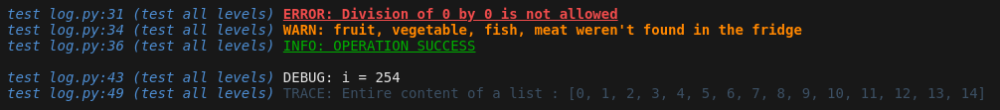
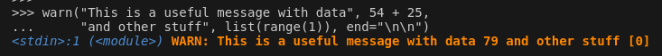

# StupidLogger

This logger is as simple as it can be while still respecting the following constraints.

1. [5 logging levels](#one)
2. [intuitive syntax](#two)
3. [easy customization](#three)
4. [simple code](#four)

It's based on `colored` (https://pypi.org/project/colored/) for the default log colors and styles, but you can also use `colorama` or other modules to set your own custom colors.



### 5 logging levels : error, warn, info, debug, trace<a name="one"></a>

You can filter out logs by using `setLogLevel`. The default level is `LogLevels.INFO`.

```python
from stupidlogger.src.log import *

setLogLevel(LogLevels.DEBUG)
```

### It uses Python's `print` syntax<a name="two"></a>

Contrary to the `logging` module, you can print multiple arguments separated by commas.

```python
warn("This is a useful message with data", 54 + 25,
     "and other stuff", list(range(1)), end="\n\n")
```


Actually the log functions' signatures are exactly the same as for `print` (you can also print to a file!).

```python
warn(*objects, sep=' ', end='\n', file=None, flush=False)
```

### The colors and header info are entirely customizable<a name="three"></a>

The log outputs are made of two parts : the header and the message.

You can change the information in the header using `setHeader`, and its color using `setSecondaryColor`.

You can also change the 5 colors associated with the log levels using `setLogColors`.

### If you still have questions<a name="four"></a>

`log.py` contains the interface. It's well documented and should provide the answers about how to use the code. The structure itself is in `loglib.py` and should provide the answers about how it works.